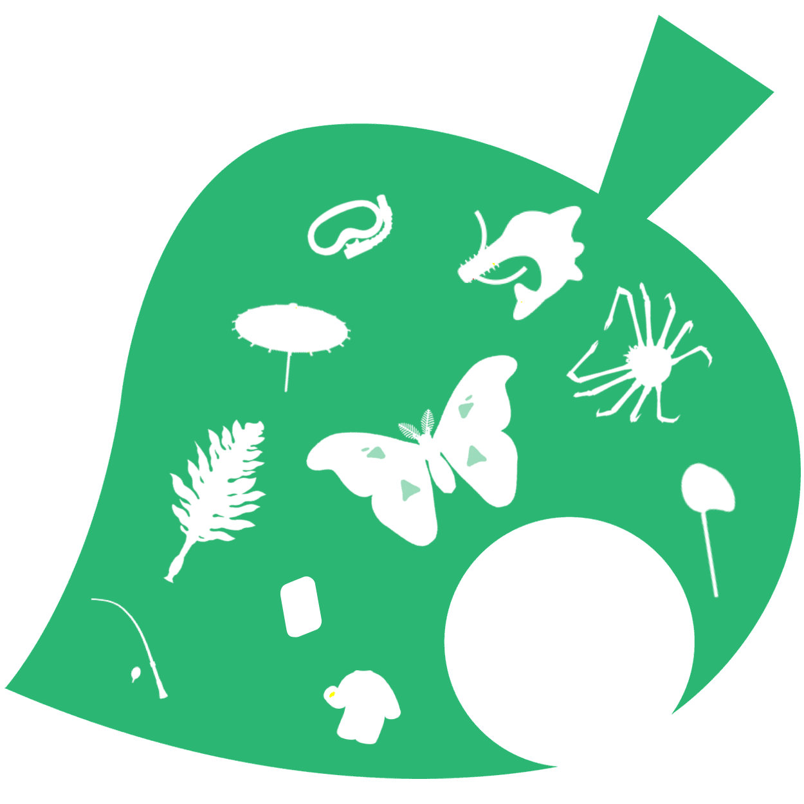
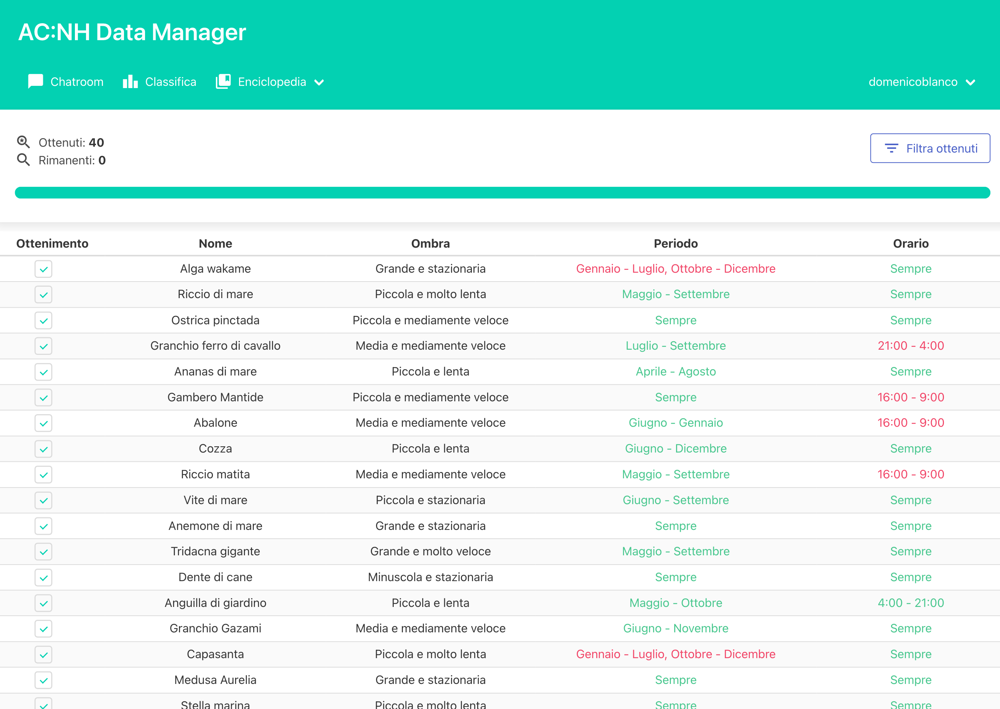
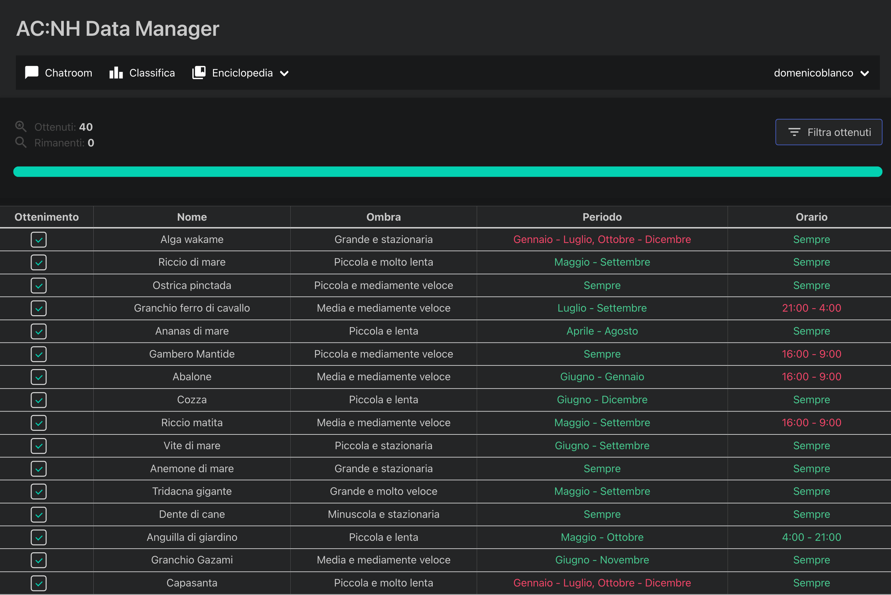
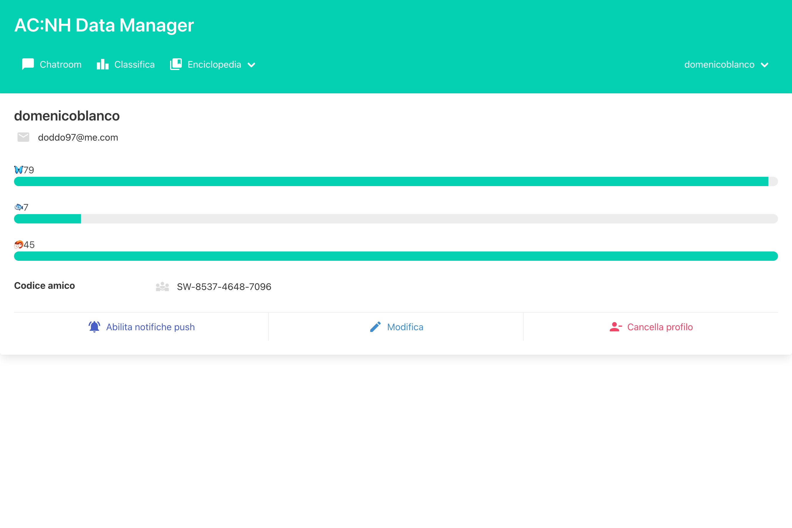
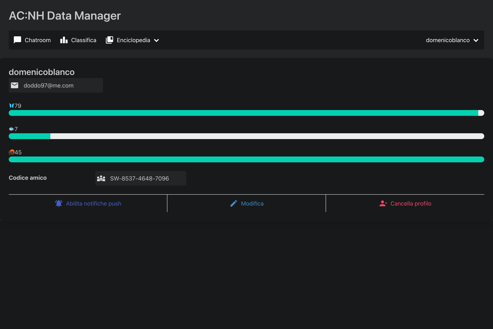

# Animal Crossing: New Horizons Data Manager

    

A minimalistic Animal Crossing: New Horizons way to track your progress with the encyclopedia, communicate with other players and remember which creature you're missing.

    
    

    
    

## Features ⚙️
- Night mode 🌙
- Responsive layout (thanks to [Bulma](https://bulma.io)) 🖥📱
- Push notifications 🔔

## How to use?
In order to run this project, [Node.js](https://nodejs.dev/en/) 16.15+ and a [Firebase](https://console.firebase.google.com/) project are required.
To enable Push Notifications, HTTPS is required. If you don't know how to achieve a valid TLS certificate, maybe you could check [Certbot](https://certbot.eff.org).

### Backend 🛠
Navigate to your Firebase project settings and generate a new service private key, this should be saved in a safe place.
To add it to the project, set into the `.env` the `GOOGLE_APPLICATION_CREDENTIALS`, the path to the just downloaded JSON.

### Frontend 👁
Navigate to your Firebase project settings and add a new web application, just fulfill the empty `FIREBASE_CONFIG` values in `config.js` and `firebase-messaging-sw.js` with the firebaseConfig constant available in your project settings.
If you would like to enable also push notifications, navigate to Cloud Messaging inside your project settings and enable the Firebase Cloud Messaging API. Just copy the key in Web Push Certificates inside `config.js`.

### Environment
In order to make easier the customization, a `.env` file is used, here are the available options:
| Name | Description |
| ---- | ----------- |
| SSL_KEY | Path to your private key |
| SSL_CERT | Path to your certificate or fullchain |
| DB_URL | Address of your Firebase Database (the same in the FIREBASE_CONFIG constant) |
| PORT | An alternative port to the default one |

### Running 
In the end, a simple `npm install .` to install dependencies followed by `node .` should be enough to run the project.

## Credits
This project has been developed by [Domenico G. Blanco](https://github.com/domenicoblanco) with ☕️, hoping to help other Animal Crossing players to track their informations easily.